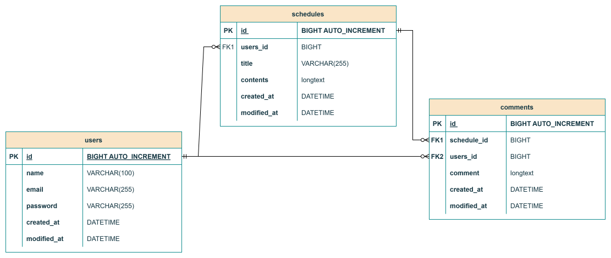

# 📆 일정 관리 앱 Develop Project
JPA 를 활용하여 CRUD 기능이 구현된 일정 관리 앱 만들기

## 📌 일정 관리 앱 요구사항

### 📋 일정에 포함되어야 할 데이터
- 일정 테이블: schedules
   1. 작성 유저명: username
   2. 할 일 제목: title
   3. 할 일 내용: contents
   4. 생성일: createdAt
   5. 수정일: modifiedAt

### 👪 유저에 포함되어야 할 데이터
- 유저 테이블: users
  1. 작성 유저명: name
  2. 이메일: email
  3. 생성일: createdAt
  4. 수정일: modifiedAt
  5. (LV3 이후) 비밀번호: password

### 📒 댓글에 포함되어야 할 데이터
- 댓글 테이블: comments
  1. 댓글 내용: comment
  2. 작성 유저: user_name
  3. 생성일: createdAt
  4. 수정일: modifiedAt

### 🔍 요구사항
- 일정 <> 유저의 연관 관계 구현
- 작성일 & 수정일은 JPA Auditing 활용
- 통신 데이터 형태(request/response) 는 JSON 형태

## 📜 API 명세서

### HTTP API 설계
- 대부분의 API 는 CRUD 작업을 수행한다.

### 설계 순서
1. HTTP Method
   * POST: CREATE
   * GET: READ
   * PATCH: UPDATE
   * DELETE: DELETE
2. Restful API → URL Mapping
3. 요청 / 응답 데이터 설계
   * HTTP Method + URL 를 통해 어떤 API 인지 구분 가능하다.

## 📑 API 상세 명세
- https://syuare.tistory.com/61
- 위의 링크 내 API 명세서 항목에서 확인 가능

## 📚 ERD (Entity Relationship Diagram)
### 1️⃣ schedules 테이블

### 2️⃣ schedules + users 테이블

### 3️⃣ (LV3 이후) users 테이블 내 password 컬럼 추가

### 4️⃣ (LV7 이후) comment 테이블 추가
