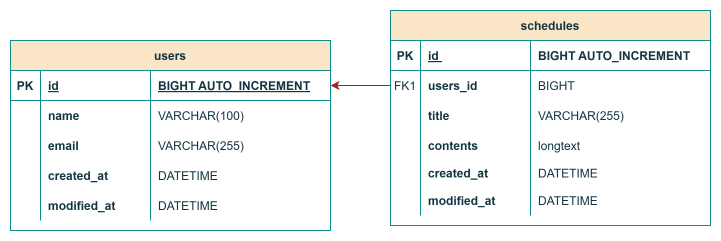
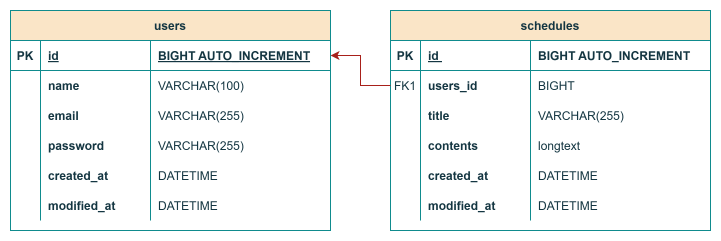

# 📆 일정 관리 앱 Develop Project
JPA 를 활용하여 CRUD 기능이 구현된 일정 관리 앱 만들기

## 📌 일정 관리 앱 요구사항

### 📋 일정에 포함되어야 할 데이터
- 일정 테이블: schedules
   1. 작성 유저명: username
   2. 할 일 제목: title
   3. 할 일 내용: contents
   4. 생성일: createdAt
   5. 수정일: modifiedAt

### 👪 유저에 포함되어야 할 데이터
- 유저 테이블: users
  1. 작성 유저명: name
  2. 이메일: email
  3. 생성일: createdAt
  4. 수정일: modifiedAt
  5. (LV3 이후) 비밀번호: password

### 🔍 요구사항
- 일정 <> 유저의 연관 관계 구현
- 작성일 & 수정일은 JPA Auditing 활용
- 통신 데이터 형태(request/response) 는 JSON 형태

## 📜 API 명세서

### HTTP API 설계
- 대부분의 API 는 CRUD 작업을 수행한다.

### 설계 순서
1. HTTP Method
   * POST: CREATE
   * GET: READ
   * PATCH: UPDATE
   * DELETE: DELETE
2. Restful API → URL Mapping
3. 요청 / 응답 데이터 설계
   * HTTP Method + URL 를 통해 어떤 API 인지 구분 가능하다.

### 📬 일정 CRUD

  <table style="white-space: nowrap;">
    <tr>
      <th>API</th>
      <th>Method</th>
      <th>URL</th>
      <th>Request</th>
      <th>Request Sample</th>
      <th>Response</th>
      <th>Response Sample</th>
      <th>HttpStatus Code</th>
    </tr>
    <tr>
      <td>일정 생성</td>
      <td>POST</td>
      <td>/api/schedules</td>
      <td>요청 Body:   1. 작성 유저명: String(필수)   2. 할 일 제목: String(필수)   3. 할 일 내용: String(필수)</td>
      <td>{   "id": 1,   "username": "test1",   "title": "Java 공부",   "contents": "Java - S.O.L.I.D 에 대해 학습하기",   "createAt": "2025-05-19",   "modifiedAt": "2025-05-19"   }</td>
      <td>생성된 일정 정보</td>
      <td>{   "id": 1,   "username": "test1",   "title": "Java 공부",   "contents": "Java - S.O.L.I.D 에 대해 학습하기",   "createAt": "2025-05-19",   "modifiedAt": "2025-05-19"   }</td>
      <td>201: 정상 생성</td>
    </tr>
    <tr>
      <td>선택 일정 조회(단건)</td>
      <td>GET</td>
      <td>/api/schedules/{scheduleId}</td>
      <td>요청 param:   - 일정 ID: Long(필수)</td>
      <td>{   "id": 1,   "username": "test1",   "title": "Java 공부",   "contents": "Java - S.O.L.I.D 에 대해 학습하기",   "createAt": "2025-05-19",   "modifiedAt": "2025-05-19"   }</td>
      <td>단건 응답 정보</td>
      <td>{   "id": 1,   "username": "test1",   "title": "Java 공부",   "contents": "Java - S.O.L.I.D 에 대해 학습하기",   "createAt": "2025-05-19",   "modifiedAt": "2025-05-19"   }</td>
      <td>200: 정상 조회</td>
    </tr>
    <tr>
      <td>전체 일정 조회</td>
      <td>GET</td>
      <td>/api/schedules</td>
      <td>-</td>
      <td>[   {   "id": 1,   "username": "test1",   "title": "Java 공부",   "contents": "Java - S.O.L.I.D 에 대해 학습하기",   "createAt": "2025-05-19",   "modifiedAt": "2025-05-19"   },   {   "id": 2,   "username": "test1",   "title": "저녁 약속",   "contents": "친구들과 파전 + 먹걸리 조합",   "createAt": "2025-05-19",   "modifiedAt": "2025-05-19"   }   ]</td>
      <td>다건 응답 정보</td>
      <td>[   {   "id": 1,   "username": "test1",   "title": "Java 공부",   "contents": "Java - S.O.L.I.D 에 대해 학습하기",   "createAt": "2025-05-19",   "modifiedAt": "2025-05-19"   },   {   "id": 2,   "username": "test1",   "title": "저녁 약속",   "contents": "친구들과 파전 + 먹걸리 조합",   "createAt": "2025-05-19",   "modifiedAt": "2025-05-19"   }   ]</td>
      <td>200: 정상 조회</td>
    </tr>
    <tr>
      <td>선택 일정 수정(단건)</td>
      <td>PATCH</td>
      <td>/api/schedules/{scheduleId}</td>
      <td>요청 param:   - 요청 ID: Long(필수)   요청 Body:   1. 작성 유저명: String(필수)   2. 할 일 제목: String(필수)   3. 할 일 내용: String(필수)</td>
      <td>{   "id": 1,   "username": "test1",   "title": "Spring 공부",   "contents": "Spring - JPA 에 대해 학습하기",   "createAt": "2025-05-19",   "modifiedAt": "2025-05-19"   }</td>
      <td>수정된 일정 정보</td>
      <td>{   "id": 1,   "username": "test1",   "title": "Spring 공부",   "contents": "Spring - JPA 에 대해 학습하기",   "createAt": "2025-05-19",   "modifiedAt": "2025-05-19"   }</td>
      <td>200: 정상 수정</td>
    </tr>
    <tr>
      <td>선택 일정 삭제(단건)</td>
      <td>DELETE</td>
      <td>/api/schedules/{scheduleId}</td>
      <td>요청 param:   - 요청 ID: Long(필수)</td>
      <td>/api/schedules/1</td>
      <td>X</td>
      <td>200 OK</td>
      <td>200: 정상 삭제</td>
    </tr>
  </table>

### 🎎 유저 CRUD

  <table style="white-space: nowrap;">
    <tr>
      <th>API</th>
      <th>Method</th>
      <th>URL</th>
      <th>Request</th>
      <th>Request Sample</th>
      <th>Response</th>
      <th>Response Sample</th>
      <th>HttpStatus Code</th>
    </tr>
    <tr>
      <td>유저 생성</td>
      <td>POST</td>
      <td>/api/users</td>
      <td>요청 Body:   1. 작성 유저명: String(필수)   2. email: String(필수)</td>
      <td>{   "id": 1,   "username": "test1",   "email": "test1@email.com",   "createAt": "2025-05-19",   "modifiedAt": "2025-05-19"   }</td>
      <td>생성된 유저 정보</td>
      <td>{   "id": 1,   "username": "test1",   "email": "test1@email.com",   "createAt": "2025-05-19",   "modifiedAt": "2025-05-19"   }</td>
      <td>201: 정상 생성</td>
    </tr>
    <tr>
      <td>선택 유저 조회(단건)</td>
      <td>GET</td>
      <td>/api/users/{userId}</td>
      <td>요청 param:   - 일정 ID: Long(필수)</td>
      <td>{   "id": 1,   "username": "test1",   "email": "test1@email.com",   "createAt": "2025-05-19",   "modifiedAt": "2025-05-19"   }</td>
      <td>단건 응답 정보</td>
      <td>{   "id": 1,   "username": "test1",   "email": "test1@email.com",   "createAt": "2025-05-19",   "modifiedAt": "2025-05-19"   }</td>
      <td>200: 정상 조회</td>
    </tr>
    <tr>
      <td>전체 유저 조회</td>
      <td>GET</td>
      <td>/api/users</td>
      <td>-</td>
      <td>[   {   "id": 1,   "username": "test1",   "email": "test1@email.com",   "createAt": "2025-05-19",   "modifiedAt": "2025-05-19"   },   {   "id": 2,   "username": "testTest2",   "email": "testTest2@email.com",   "createAt": "2025-05-19",   "modifiedAt": "2025-05-19"   }   ]</td>
      <td>다건 응답 정보</td>
      <td>[   {   "id": 1,   "username": "test1",   "email": "test1@email.com",   "createAt": "2025-05-19",   "modifiedAt": "2025-05-19"   },   {   "id": 2,   "username": "testTest2",   "email": "testTest2@email.com",   "createAt": "2025-05-19",   "modifiedAt": "2025-05-19"   }   ]</td>
      <td>200: 정상 조회</td>
    </tr>
    <tr>
      <td>선택 유저 정보 수정(단건)</td>
      <td>PATCH</td>
      <td>/api/users/{userId}</td>
      <td>요청 param:   - 요청 ID: Long(필수)   요청 Body:   1. 작성 유저명: String(필수)   2. 수정 이메일: String(필수)</td>
      <td>{   "id": 1,   "username": "test1",   "email": "editTest1@email.net",   "createAt": "2025-05-19",   "modifiedAt": "2025-05-19"   }</td>
      <td>수정된 유저 정보</td>
      <td>{   "id": 1,   "username": "test1",   "email": "editTest1@email.net",   "createAt": "2025-05-19",   "modifiedAt": "2025-05-19"   }</td>
      <td>200: 정상 수정</td>
    </tr>
    <tr>
      <td>선택 유저 삭제(단건)</td>
      <td>DELETE</td>
      <td>/api/users/{userId}</td>
      <td>요청 param:   - 요청 ID: Long(필수)</td>
      <td>/api/users/1</td>
      <td>X</td>
      <td>200 OK</td>
      <td>200: 정상 삭제</td>
    </tr>
  </table>

## 📚 ERD (Entity Relationship Diagram)
### 1️⃣ schedules 테이블

### 2️⃣ schedules + users 테이블

### 3️⃣ (LV3 이후) users 테이블 내 password 컬럼 추가
